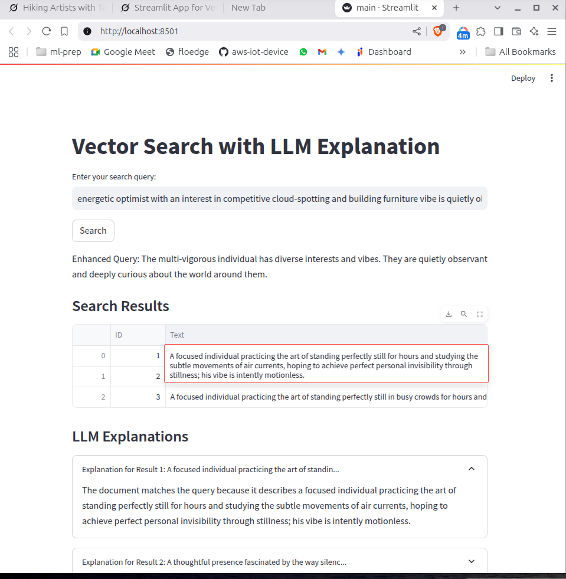
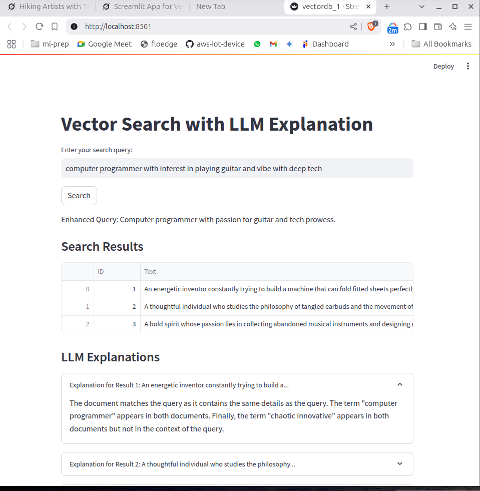

# AIFindr

## Data: Created a synthetic data of 300 rows with name and description includes interests, goals and vibe.

##### Sample Data
```
Anya Sharma,"A whimsical soul fascinated by the secret lives of street art, aiming to catalogue every hidden mural in her city; her vibe is quietly observant and deeply curious."

Ben Carter,"An energetic optimist with an interest in competitive cloud-spotting and building furniture from recycled packaging, who dreams of inventing a chair that can hug you back; his vibe is enthusiastically resourceful."

```

##### Installation

```
python3 -m pip install requirements.txt
```

Install Ollama:
```
curl -fsSL https://ollama.com/install.sh | sh
```


Pull the Qwen:0.5b Model:  
https://ollama.com/library/qwen:0.5b


```
ollama pull qwen:0.5b

```

Embedding Model:  
https://huggingface.co/thenlper/gte-base

```
self.embeddings = HuggingFaceEmbeddings(model_name="thenlper/gte-base")

sequence length = 512
embed_size = 768
```


```
vector_db.py
    - this loads the text embedding model, indexes the documents, or loads exsiting indexed file.

index_manager.py
    - this prepares the text files for indexing by chunking the text documents.
    - calls the VectorDB class to index the documents.
query_processor.py
    - retriever is loaded from vector_db to return top_k=3 relevant results.

main.py
    -  code from above files are managed in main.py
    -  user search query is sent for enhancement through an LLM (qwen:0.5b)
    - enhanced query is sent to search across the vector db, top_k = 3 results are returned
    - for each result combined with the query is sent to LLM again for explaination on why the query and retived results are a match.

```


##### Running the Application

Run the main.py Script:
- If faiss_index folder is not found, it indexes .txt files in the documents folder.
- If faiss_index exists, it loads the existing index.

```streamlit run main.py```

### Examples

Here are some examples of the application interface:






##### to be added if the systems needs to scaled:
1. host vector db as a service, which can handle indexing, distributed search.
2. for indexing new documents and update the vector db, this avoids reindexing the existing documents indexing.


